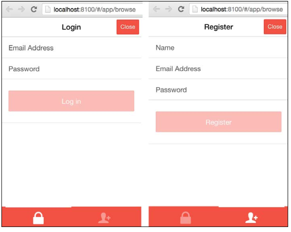
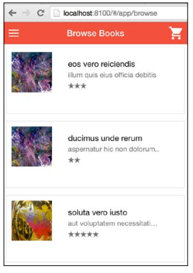
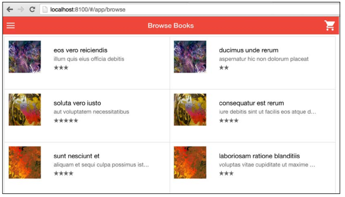
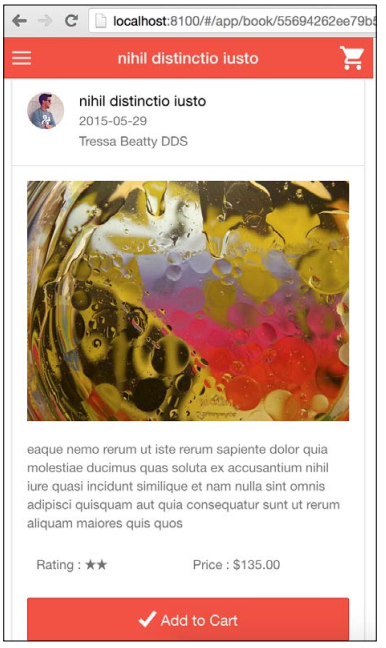
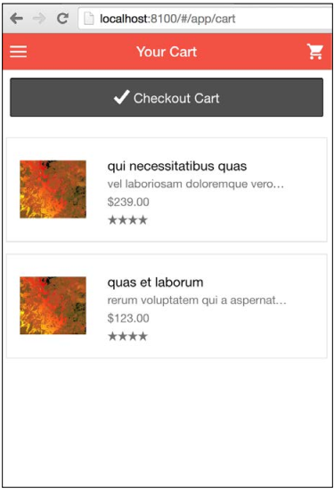
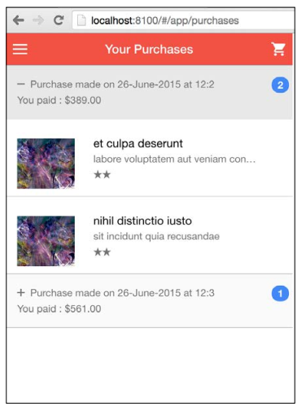

## 第五步 - 创建模板并使用控制器数据进行整合

现在我们的控制器准备好了数据，那么我们将创建模板来展示这些数据。

### 登录模板

第一个是登录模板， _login.html_ ：

```
<ion-modal-view>
<div class="tabs-striped tabs-background-assertive tabs-colorlight">
    <div class="tabs">
        <a class="tab-item" ng-class="{active : viewLogin}" href="javascript:" ng-click="switchTab('login')">
            <i class="icon ion-locked"></i> Login
        </a>
        <a class="tab-item" ng-class="{active : !viewLogin}" href="javascript:" ng-click="switchTab('register')">
            <i class="icon ion-person-add"></i> Register
        </a>
    </div>
</div>
    <!-- login pane -->
    <ion-pane ng-show="viewLogin">
        <ion-header-bar>
            <h1 class="title">Login</h1>
            <div class="buttons">
                <button class="button button-assertive" ngclick="hide()">Close</button>
            </div>
        </ion-header-bar>
        <ion-content>
            <form>
                <div class="list">
                    <label class="item item-input">
                        <span class="input-label">Email</span>
                        <input type="email" ng-model="user.email">
                    </label>
                    <label class="item item-input">
                        <span class="input-label">Password</span>
                        <input type="password" ngmodel="user.password">
                    </label>
                    <label class="item">
                        <button class="button button-block buttonassertive" ng-click="login()" ng-disabled="!user.email || !user.password" type="submit">Log in</button>
                    </label>
                </div>
            </form>
        </ion-content>
    </ion-pane>
    <!-- register pane -->
    <ion-pane ng-hide="viewLogin">
        <ion-header-bar>
            <h1 class="title">Register</h1>
            <div class="buttons">
                <button class="button button-assertive" ngclick="hide()">Close</button>
            </div>
        </ion-header-bar>
        <ion-content>
            <form>
                <div class="list">
                    <label class="item item-input">
                        <span class="input-label">Name</span>
                        <input type="text" ng-model="user.name">
                    </label>
                    <label class="item item-input">
                        <span class="input-label">Email  Address </span>
                        <input type="text" ng-model="user.email">
                    </label>
                    <label class="item item-input">
                        <span class="input-label">Password</span>
                        <input type="password" ngmodel="user.password">
                    </label>
                    <label class="item">
                        <button class="button button-block buttonassertive" ng-click="register()" ng-disabled="!user.name || !user.email || !user.password" type="submit" type="submit">Register</button>
                    </label>
                </div>
            </form>
        </ion-content>
    </ion-pane>
</ion-modal-view>
```

_login_ 模板有一个用在 _Login_ 和 _Register_ 视图之间切换的标签组件。这个tabs组件不是一个Ionic tab指令，而是一个普通的Tab CSS组件。
点击标签图标的时候，我们将使用 _switchTab_ 方法来切换 _viewLogin_ 为 _true_ 或者 _false_ 以在 **Login** 和 **Register** 视图之间进行切换。

完整的登录模板视图效果如下（也可以点击 **Register** 图标来查看注册视图）：



### 浏览模板（Browse template）

接下来进行的是 _Browse_ 模板。这个模板将用来展示书籍列表。打开 _www/templates/browse.html_ 更新内容为如下：

```
<ion-view view-title="Browse Books" hide-back-button="true">
    <ion-content>
        <ion-list>
            <div ng-repeat="book in books track by $index" class="row responsive-sm" ng-if="$index % 2 == 0">
                <ion-item class="col-50" ng-repeat="i in [$index, $index + 1]" ng-if="books[i] != null" ng-href="#/app/book/{{::books[i]._id}}">
                    <div class="item-thumbnail-left">
                        
                        <h2>{{::books[i].title}}</h2>
                        <p>{{::books[i].short_description}}</p>
                        <p>
                            <i class="icon ion-star" ng-repeat="i in getNumber(books[i].rating) track by $index"></i>
                        </p>
                    </div>
                </ion-item>
            </div>
        </ion-list>
    </ion-content>
</ion-view>
```
> 之前的模板中，我是用 {{::property}} 来替代{{property}}。 {{::property}}是AngularJS中单向数据绑定的方法。当模板中使用的属性的值在初始绑定之后后续不会进行更改的时候，单向数据绑定是再理想不过的了
> 这个应用就使用单向数据绑定就非常完美。值绑定到模板之后，我们就不会在更新他了。这样一来我们可以节省AngularJS对我们变量循环诊断的消耗了。
> 更多关于单向数据绑定的信息请参考：[http://blog.thoughtram.io/angularjs/2014/10/14/exploring-angular-1.3-onetime-bindings.html](http://blog.thoughtram.io/angularjs/2014/10/14/exploring-angular-1.3-onetime-bindings.html)

在此模板中，我们使用了 *ion-list* 来展示书籍列表。我早先也描述了如何使用Ionic的格子系统来实现。

在之前的模板中，我们显示了两行书籍，只是视窗是一个移动设备。我们使用两个循环实现了格子视图。外层循环组成类名为 *item* 的元素，内层循环组成他的条目，类名为 *col-50*

同时，我们给外部循环添加了类 *responsive-sm* 以高速Ionic格子系统，如果设备比较小，那么就渲染为以列就可以了。

移动视窗的渲染效果如下：



桌面版是这样的：



### 书籍模板（Book template）

当用户在浏览模板里面点击书籍以查看详情的时候，我们会重定向到 _/book_ 页。在此处我们展示了书籍的详细信息并带有一个 **Add to Cart** 按钮。
以下是 _www/templates/book.html_ 的源代码：

```
<ion-view view-title="{{::book.title}}" hide-back-button="true">
    <ion-content>
        <div class="list card">
            <div class="item item-avatar">
                
                <h2>{{::book.title}}</h2>
                <p>{{::book.release_date | date:'yyyy-MM-dd'}}</p>
                <p>{{::book.author}}</p>
            </div>
            <div class="item item-body">
            
            <p>
            {{::book.long_description}}
            </p>
            <p class="row">
                <label class="col">
                    Rating : <i class="icon ion-star" ngrepeat="i in getNumber(book.rating) track by $index"></i>
                </label>
                <label class="col">
                    Price :
                    <label class="subdued">{{::book.price | currency}} $</label>
                </label>
            </p>
                <button class="button button-assertive buttonblock" ng-click="addToCart()">
                <i class="icon ion-checkmark"></i> Add to Cart
                </button>
            </div>
        </div>
    </ion-content>
</ion-view>
```

模板中需要提及的是新增的 **Rating** 部分，此处使用了一个 _ng-repeat_ 根据评分值来动态打印星星。我们用到了之前在 _run_ 方法里面定义的 _getNumber_ 方法。

渲染好的数据模板效果如下：



### 购物车模板（Cart template）

购物车模板跟 **Browse** 模板很想，除了在顶部添加了一个检出（checkout）按钮以及在购物车没有条目的时候的一个倒回信息（fall back message）。
 _www/templates/cart.html_ 源代码如下：

```
<ion-view view-title="Your Cart" cache-view="false" hide-backbutton="true">
    <ion-content>
        <div class="padding">
            <button class="button button-block button-dark" ngshow="books.length > 0" ng-click="checkout()">
                <i class="icon ion-checkmark"></i> Checkout Cart
            </button>
        </div>
        <ion-list>
            <div ng-repeat="book in books track by $index" class="row responsive-sm" ng-if="$index % 2 == 0">
                <ion-item class="col-50" ng-repeat="i in [$index, $index + 1]" ng-if="books[i] != null" ng-href="#/app/book/{{::books[i]._id}}">
                    <div class="item-thumbnail-left">
                        
                        <h2>{{::books[i].title}}</h2>
                        <p>{{::books[i].short_description}}</p>
                        <p>{{::books[i].price}} $</p>
                        <p>
                        <i class="icon ion-star" ng-repeat="i
                        in getNumber(books[i].rating) track by $index"></i>
                        </p>
                    </div>
                </ion-item>
            </div>
        </ion-list>
        <div class="card" ng-show="books.length == 0">
            <div class="item item-text-wrap text-center">
            <h2>No Books in your cart!</h2>
            <br>
            <a href="#/app/browse">Add a few</a>
            </div>
        </div>
    </ion-content>
</ion-view>
```

渲染后效果如下：



### 订购模板

最后一个模板是订购模板。（终于！！脖子快要断了！！！）为了让显示方法有所变化，我使用了一个嵌入列表展示订购列表，而不是用一个主详情页。
主详情偏向于在本页上列出所有的订购信息；当用户点击的时候，我们将用户带到另一个页面以显示订购详情。（与 **Browse** 和 **Book** 页面的关系一样）

这样，所有订购信息都根据订购时间进行分组，然后作为第一级列表显示。当用户点击组头的时候，我们显示此组内的订购书籍列表。

> 这是一个Accordion组件。更多信息参考： [http://forum.ionicframework.com/t/expandable-list-in-ionic/3297/2](http://forum.ionicframework.com/t/expandable-list-in-ionic/3297/2)

打开 _www/templates/purchases.html_ 更新如下：

```
<ion-view view-title="Your Purchases" cache-view="false" hideback-button="true">
<ion-content>
<ion-list>
<div ng-repeat="group in groups">
<ion-item class="item-stable" ngclick="toggleGroup(group)" ng-class="{active: isGroupShown(group)}">
<p><i class="icon" ngclass="isGroupShown(group) ? 'ion-minus' : 'ion-plus'"></i>
    {{::group.name}}
<span class="badge badgepositive">{{::group.items.length}}</span></p>
<p>You paid : {{::group.total | currency}}</p>
</ion-item>
<ion-item class="item-accordion" ng-repeat="item in group.items" ng-show="isGroupShown(group)" nghref="#/app/book/{{::item._id}}">
<div class="item-thumbnail-left">

<h2>{{::item.title}}</h2>
<p>{{::item.short_description}}</p>
<p>
<i class="icon ion-star" ng-repeat="i in getNumber(item.rating) track by $index"></i>
</p>
</div>
</ion-item>
</div>
</ion-list>
</ion-content>
</ion-view>
```

保存文件然后返回浏览器，你将看到：



好了，最后一击：添加一些样式。更新 _www/css/styles.css_ 如下：

```
.item-thumbnail-left,
.item-thumbnail-left .item-content {
    min-height: 75px;
}
.ion-android-cart:before {
    font-size: 24px !important;
}
.item-thumbnail-left > img:first-child,
.item-thumbnail-left .item-image,
.item-thumbnail-left .item-content > img:first-child,
.item-thumbnail-left .item-content .item-image {
    top: 27px;
    left: 16px;
    padding-bottom: 10px;
}
.badge.badge-positive {
    position: absolute;
    right: 5px;
}
```

## 总结

本章中，我们学习了如何利用已有的REST API创建一个Ionic应用。
我们也学习了如何使用基于token的服务器和处理需要认证的路由对比不需要认证的路由。
这个手打范例帮助你巩固了已有的Ionic只是。

下一章中，我们将要学习Cordova插件，以及如何使用ngCordova。
