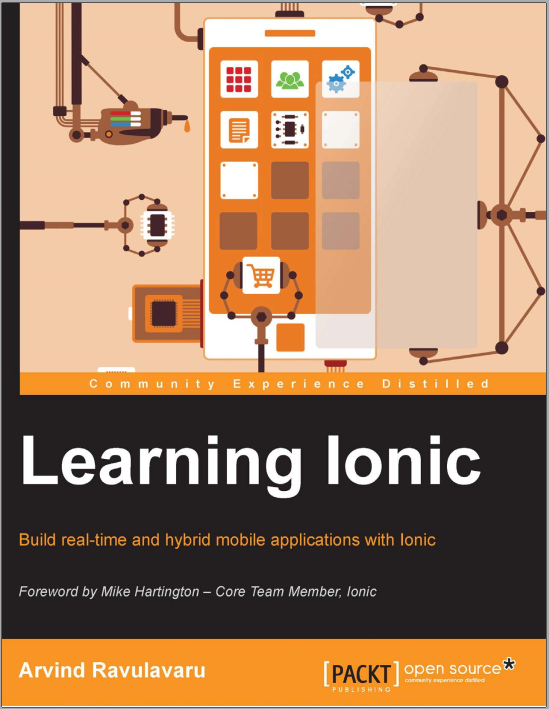

# 学习Ionic - 使用Ionic构建实时混合移动应用

## 作者:[Arvind Ravulavaru](https://github.com/arvindr21)

Ionic 1入门与进阶手册。

\[Ionic 2入门与进阶\]\(https://legacy.gitbook.com/book/adobeattheworld/building-mobile-apps-with-ionic-2/details\)

---

2016-10-7       首译完成  
2016-10-18      开始review

2016-12-28   不更新了

有需要的可以自己去github fork

校对：[ManInBoat](https://github.com/ManInBoat)

原本：[https://github.com/learning-ionic](https://github.com/learning-ionic)

译本：[https://github.com/AdoBeatTheWorld/learning\_ionic\_chinese](https://github.com/AdoBeatTheWorld/learning_ionic_chinese)

